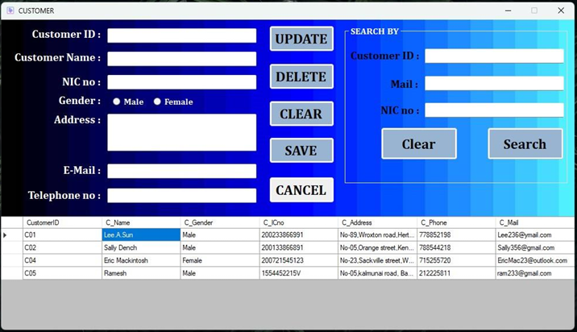

# Polly Pipe Database Management System

## Project Overview

Polly Pipe is a water sports provider and installer, specializing in placing tailor-made aquariums at business customers' facilities. This project involves designing and implementing a database to manage the data requirements related to installations, facilities, employees, equipment, and more.

  

## Features

- **Customer Management**: Track and manage customer details and their installation requests.
- **Facility Management**: Record and manage details about facilities, including their types and related employees.
- **Employee Management**: Manage information about employees, including their roles and assignments to facilities.
- **Equipment Management**: Track various equipment used in installations, such as aquariums, air pumps, and thermostats.
- **Installation Tracking**: Record details of each installation, including customer, facility, and equipment information.

   
  

## Technologies Used
- **Language**: C#
- **Development Environment**: Visual Studio
- **Database**: MS SQL Server

## Database Design
- **Customer Table**: Stores information about customers and their installation requests.
- **Facility Table**: Contains details about facilities, their types, and assigned employees.
- **Employee Table**: Manages employee information and their roles.
- **Equipment Table**: Records details of equipment used in installations.
- **Installation Table**: Tracks each installation, linking customers, facilities, and equipment.

## Getting Started
1. Clone the repository: `git clone https://github.com/Nava-stack/pollypipe-system.git`
2. Open the project in Visual Studio.
3. Set up the MS SQL Server database.
4. Restore the database schema and data from `database/PollyPipe.sql`.
5. Configure the database connection settings in `appsettings.json` or the relevant configuration file.
6. Build and run the application.

## License
This project is licensed under the MIT License - see the [LICENSE](LICENSE) file for details.
